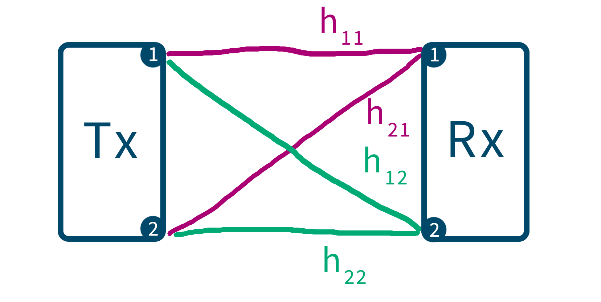
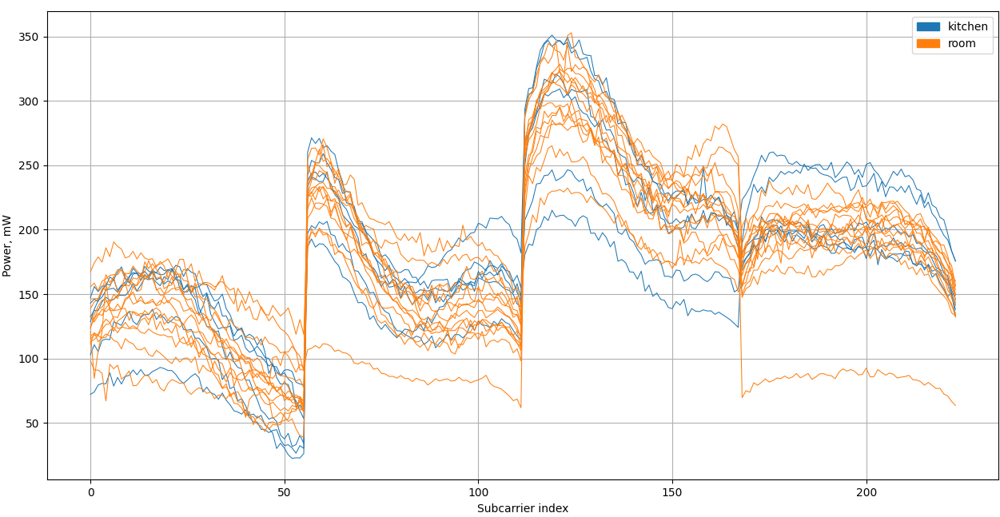

# Annotation
This repository contains a project dedicated to the classification (recognition) and positioning (in the future) of objects using Wi-Fi signals. Today, Wi-Fi technology is starting to go beyond our usual uses. One such example is the ability to perform classification using the Channel State Information or CSI. Each physical object introduces its own distortions in the transmitted signal, which allows classification it.

## Equipment
For collect CSI I use two routers (model is WR842ND) with [this](https://github.com/xieyaxiongfly/OpenWRT_firmware) special OpenWRT firmware. This firmware contains `recvCSI` and `sendData` functions.

## CSI
When transmitting a Wi-Fi signal, the receiver can receive **Channel State Information** (CSI), which contains complex numbers describing the amplitude and phase of the signal subcarriers.

Since the routers used have antennas, we have 4 signal paths.

Fig. 1. Wi-Fi signal transmission scheme. hXX are the signal paths

All 4 paths are connected horizontally into one large data packet (one line in Fig. 2.). I mainly use amplitudes for research, as they provide higher machine learning accuracy results.

Fig. 2. Combined amplitude feature arrays for all 4 paths. Data is binary human position

## Data files
I get CSI from special data-files recorded by the receiving router (Rx). They are grouped by experiments in the `csi` folder

# Launch project
The project is launched using the main script `clf.py`. Explanations are in the code as comments.

## Python libraries
The main library that I use for data preprocessing is [Pandas](https://github.com/pandas-dev/pandas). For machine learning I use [Keras](https://github.com/keras-team/keras) with [Tensorflow](https://github.com/tensorflow/tensorflow) backend

To analyze the correlation of features, a small [feature-selector](https://github.com/WillKoehrsen/feature-selector) module is used.

## C-dll

## Project structure

# License
This code is released under the MIT license.

# Progress
Several scientific research have been published on the topic of this project:

1. [РАЗРАБОТКА МЕТОДОВ КЛАССИФИКАЦИИ ОБЪЕКТОВ НА БАЗЕ МАРШРУТИЗАТОРОВ WI-FI](https://www.elibrary.ru/item.asp?id=42838861) - РИНЦ, 2020
1. [Object Classification Based on Channel State Information Using Machine Learning](https://www.scopus.com/authid/detail.uri?authorId=57220804725) - Scopus, 2020
1. [ИСПОЛЬЗОВАНИЕ МЕТОДА МАШИННОГО ОБУЧЕНИЯ «СЛУЧАЙНЫЙ ЛЕС» ДЛЯ ПОЗИЦИОНИРОВАНИЯ ЧЕЛОВЕКА В ПОМЕЩЕНИЯХ ПРИ ПОМОЩИ СИГНАЛА WI-FI](https://www.elibrary.ru/item.asp?id=44503956) - РИНЦ, 2020
1. Analysis Of Classification Methods For Wi-Fi Signals Based On The Use Of Channel State Information Spatial Features And CNN - Scopus, 2021 (in the process of release)
